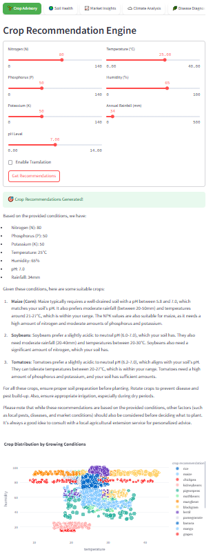
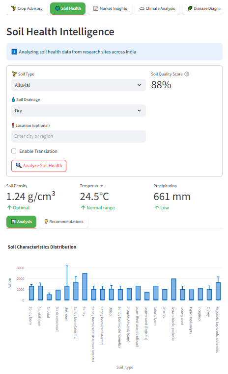
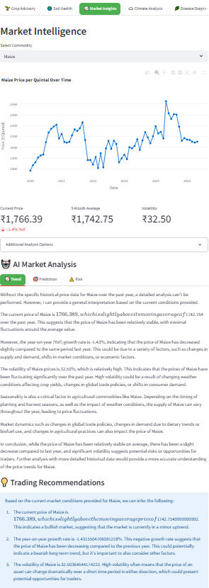
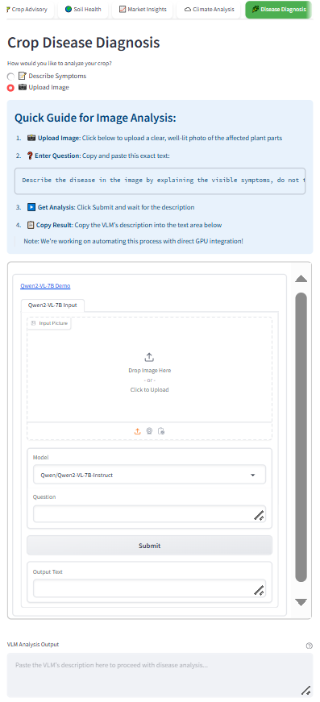

# Smart Farming Multi-Agent System

Welcome to the **Smart Farming Multi-Agent System**! This innovative system is designed to revolutionize modern agriculture by providing farmers and agricultural professionals with intelligent, data-driven insights and recommendations. By using the power of **Multi-Agent Systems (MAS)**, this platform integrates specialized AI agents to address various aspects of farming, from crop selection and soil health to market trends and climate predictions.

In today’s world, **smart farming** is no longer a luxury but a necessity. With the integration of IoT devices for real-time data processing, this system has the potential to become even more powerful and accessible. Currently, the system uses scraped data from the internet, but future enhancements could include live data feeds for more accurate and timely decision-making.

---

## What Are Agents?

Agents are autonomous systems that analyze and act based on their environment to achieve specific goals. They can retrieve, process, and synthesize information, making decisions dynamically rather than following rigid rules. In the context of **smart farming**, agents are specialized AI models that focus on specific tasks, such as crop advisory, soil analysis, or disease detection.

### Why Multi-Agent Systems in Farming?

Farming is a complex domain with numerous interdependent factors, such as soil quality, weather conditions, market trends, and crop health. Relying on a single AI model to handle all these aspects is inadequate. **Multi-Agent Systems (MAS)** introduce specialization by assigning distinct roles to different AI agents. These agents work together, each focusing on a specific task, to provide a comprehensive and cohesive solution for farmers.

---

## Table of Contents

1. [Overview](#overview)
2. [Agents and Their Behaviors](#agents-and-their-behaviors)
   - [Crop Advisor](#crop-advisor)
   - [Soil Analyst](#soil-analyst)
   - [Market Strategist](#market-strategist)
   - [Climate Predictor](#climate-predictor)
   - [Disease Detector](#disease-detector)
   - [Guide Agent](#guide-agent)
3. [File Structure](#file-structure)
4. [How to Use](#how-to-use)
5. [Agentic Behaviors](#agentic-behaviors)
6. [Conclusion](#conclusion)

---

## Overview

The **Smart Farming Multi-Agent System** is a sophisticated tool that uses artificial intelligence to provide actionable insights for farmers. The system is composed of **six core agents**, each specializing in a different aspect of farming, and a **Guide Agent** that helps users navigate the system. Together, these agents provide a comprehensive suite of tools for smart farming, enabling farmers to make data-driven decisions that optimize productivity, sustainability, and profitability.

---

## Agents and Their Behaviors

Each agent in the system is designed to perform a specific task, using advanced AI techniques to provide accurate and actionable insights. Below is a detailed overview of each agent, its capabilities, and how it contributes to the overall system.

---

### Crop Advisor

**File:** `agents/CropAdvisoryAgent.py`  
**UI:** 

#### Overview

The **Crop Advisor** is an intelligent AI-driven system designed to provide data-backed agricultural recommendations. It helps farmers and agronomists make informed decisions about crop selection based on soil composition, climate conditions, and nutrient availability.

#### Key Features

- **Smart Crop Recommendation:** Uses soil, climate, and nutrient data to suggest the best crops for given conditions.
- **AI-Enhanced Insights:** Analyzes past crop performance and environmental factors to refine recommendations.
- **Multilingual Support:** Provides advisory insights in multiple languages, including English, Hindi, Malayalam, Tamil, and Telugu.
- **Interactive Data Visualization:** Displays crop suitability through dynamic plots and statistics.

#### Agentic Capabilities

- **Memory:** Stores past crop profiles and advisory interactions to improve future recommendations.
- **Reasoning:** Uses data-driven analysis and AI insights to provide scientifically sound recommendations.
- **Tool Calling:** Interfaces with a vector search engine (VectorLake) and an AI model (ModelLake) to enhance decision-making.
- **Orchestration:** Coordinates data retrieval, analysis, and user interaction seamlessly for a smooth advisory experience.

#### How It Works

1. Users input soil, climate, and nutrient conditions.
2. The agent searches for similar crop profiles using vector search.
3. AI-driven reasoning refines recommendations with contextual insights.
4. Users receive actionable recommendations, visualizations, and multilingual support.

---

### Soil Analyst

**File:** `agents/SoilHealthAgent.py`  
**UI:** 

#### Overview

The **Soil Analyst** is an AI-powered agent designed to analyze and improve soil health through data-driven insights. It processes soil data, evaluates key indicators, and provides tailored recommendations to optimize agricultural productivity.

#### Key Features

- **Data-Driven Soil Analysis:** Ingests, cleans, and processes soil health datasets to derive meaningful insights.
- **AI-Powered Recommendations:** Generates expert guidance on soil management, crop selection, and improvement strategies.
- **Geolocation-Based Insights:** Utilizes location data to provide region-specific soil health analysis.
- **Interactive Visualization:** Displays soil quality metrics, trends, and distributions using dynamic charts.
- **Multilingual Support:** Provides soil health insights in multiple languages for broader accessibility.

#### Agentic Capabilities

- **Memory:** Retains and refines soil data across different locations to improve recommendations over time.
- **Reasoning:** Analyzes soil characteristics, climate conditions, and historical data to generate informed insights.
- **Tool Calling:** Interacts with external APIs (e.g., geolocation services, AI models) to enrich soil health evaluations.
- **Orchestration:** Coordinates retrieval, analysis, and recommendation processes to provide comprehensive soil assessments.

#### How It Helps

- Identifies soil health trends and risks.
- Suggests optimal crops based on soil conditions.
- Recommends best soil management practices.
- Improves sustainable agricultural decision-making.

---

### Market Strategist

**File:** `agents/MarketInsightsAgent.py`  
**UI:** 

#### Overview

The **Market Strategist** is an AI-powered analytics tool designed to provide in-depth market intelligence for agricultural commodities. It offers real-time insights, price trends, risk analysis, and trading recommendations.

#### Key Features

- **Market Trend Analysis:** Detects seasonal and long-term price movements for various commodities.
- **Price Predictions:** Uses historical data to forecast future price trajectories.
- **Risk Assessment:** Identifies market volatility and potential risks.
- **Trading Recommendations:** Offers actionable advice for commodity trading strategies.
- **Multilingual Support:** Provides insights in English, Hindi, Malayalam, Tamil, and Telugu.
- **Dynamic Data Processing:** Aggregates and visualizes real-time market metrics.

#### Agentic Capabilities

- **Memory:** Stores past market data and insights for continuous learning.
- **Reasoning:** Analyzes historical trends to generate data-driven predictions.
- **Tool Calling:** Integrates with external databases and APIs for comprehensive insights.
- **Orchestration:** Coordinates multiple analytical functions to deliver holistic market intelligence.

#### How It Works

1. Users select a commodity from an interactive dashboard.
2. The agent retrieves and analyzes historical market data.
3. Insights are categorized into trends, predictions, risks, and recommendations.
4. Visualizations and metrics are presented for informed decision-making.

---

### Climate Predictor

**File:** `agents/ClimateAnalysisAgent.py`  
**UI Placeholder:** 

#### Overview

The **Climate Predictor** is an intelligent system designed to provide real-time weather insights. It retrieves and analyzes weather data for any given location, offering valuable insights into climate conditions, agricultural implications, and safety recommendations.

#### Key Features

- **Reflection:** Corrects and standardizes location names to avoid tool failures.
- **Tool Calling:** Utilizes the Tomorrow.io API to fetch real-time weather data.
- **Reasoning:** Interprets weather conditions to generate AI-driven insights on agricultural impact and safety precautions.
- **Orchestration:** Coordinates geolocation services, weather APIs, and AI-driven analysis to deliver a seamless experience.

#### How It Works

1. User inputs a location.
2. The agent reflects on and corrects location errors.
3. Geolocation processing converts the location name to coordinates.
4. Weather data is retrieved and analyzed.
5. AI insights are generated and displayed in a user-friendly format.

---

### Disease Detector

**File:** `agents/DiseaseDiagnosisAgent.py`  
**UI:** 

#### Overview

The **Disease Detector** is an intelligent system designed to help farmers diagnose and manage crop diseases more effectively. It analyzes disease symptoms, environmental factors, and past cases to provide precise, evidence-based recommendations.

#### Key Features

- **Memory:** Stores and recalls past cases for improved diagnosis and recommendations.
- **Task Planning:** Structures the diagnostic process by systematically collecting symptoms, environmental factors, and treatment history.
- **Reasoning:** Uses advanced models to analyze symptoms and cross-reference similar cases for accurate disease identification.
- **Tool Calling:** Interacts with external vector search and language models to enhance analysis with embedded knowledge.
- **Orchestration:** Coordinates multiple data sources and AI models to deliver comprehensive, context-aware insights.

#### How It Works

1. Users provide symptoms and additional context.
2. The agent retrieves similar cases from its disease knowledge base.
3. AI analysis generates a structured report with potential diseases and management strategies.
4. Actionable insights are provided, including treatment options and preventive measures.

---

### Guide Agent

**File:** `agents/GuideAgent.py`  
**UI Placeholder:** 

#### Overview

The **Guide Agent** is an AI-powered assistant designed to help farmers navigate the system and make informed decisions. It provides personalized recommendations and guidance, making modern farming more efficient and data-driven.

#### Key Capabilities

- **Memory:** Remembers past interactions to provide better responses over time.
- **Reflection:** Refines suggestions based on previous user queries.
- **Task Planning:** Directs users to the most relevant farming tools based on their needs.
- **Reasoning:** Analyzes user inputs and farming data to make intelligent decisions.
- **Tool Calling:** Suggests and guides users to the best tools for crop advisory, soil health analysis, market insights, climate forecasting, and disease diagnosis.
- **Orchestration:** Coordinates various agricultural tools for a comprehensive advisory experience.

#### How It Helps

- Provides tailored crop recommendations.
- Offers soil health analysis and improvement suggestions.
- Delivers market insights and profit opportunities.
- Assists with climate planning and disease diagnosis.

---

## File Structure

The codebase is organized as follows:

```
.streamlit/
  config.toml
agents/
  ClimateAnalysisAgent.py
  CropAdvisoryAgent.py
  DiseaseDiagnosisAgent.py
  GuideAgent.py
  MarketInsightsAgent.py
  SoilHealthAgent.py
data/
  tab1-crop_advisory.csv
  tab2-soil-health.csv
  tab3-market_insights.csv
  tab5-crop_diseases.csv
raw data/
  _Food+Price+data_WFP_2020Dec23_Senegal_FoodPricesData.csv
  Crop_recommendation.csv
  srdb-data.csv
.env
.gitignore
agriculture-industry.jpg
app.py
dataset_cleaning.ipynb
download_modules.js
idk.ipynb
image.jpg
package-lock.json
package.json
packages.txt
README.md
requirements.txt
scraper.ipynb
weather_fetch.mjs
```

---

## How to Use

### Option 1: Use the Deployed App

Access the deployed application via the provided link.
https://farm1ing.streamlit.app/

### Option 2: Run Locally

1. **Install Dependencies:** Run `pip install -r requirements.txt`.
2. **Install npm:** Run `npm install node-fetch@2.6.7 moment@2.29.4 query-string@7.1.1`.
3. **Run the Application:** Execute `streamlit run app.py`.
4. **Navigate the Interface:** Use the tabs to access different agents and tools.
5. **Follow the Guide:** Click the "Not sure where to start?" button for guidance from the **Guide Agent**.

---

## Agentic Behaviors

Each agent in the system exhibits one or more human-like behaviors, such as:

- **Memory:** Stores data and past interactions to improve future performance.
- **Reflection:** Analyzes past actions to refine strategies.
- **Task Planning:** Plans sequences of actions to achieve specific goals.
- **Reasoning:** Uses data and logic to make informed decisions.
- **Tool Calling:** Interacts with external tools and APIs to gather data.
- **Orchestration:** Coordinates with other agents to provide comprehensive solutions.

---

## Conclusion

The **Smart Farming Multi-Agent System** is a powerful tool for modern agriculture. By using the specialized capabilities of each agent, farmers can make informed decisions that improve crop yield, soil health, market profitability, and overall farm management. The system's human-like behaviors ensure that it provides intelligent, context-aware recommendations tailored to the unique needs of each user.
